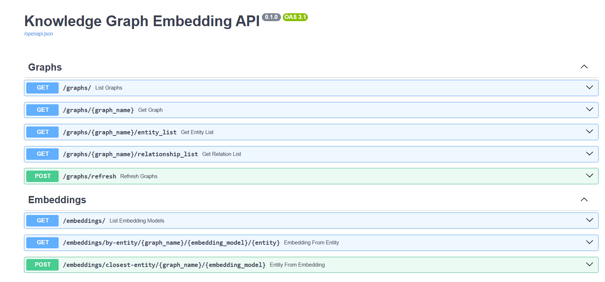

# KGEM-API + News Recommendation Microservice

A project focused on exploiting Knowledge Graph Embeddings for tasks related to news recommendation.

This work is part of the [AMOR project](https://www.gsi.upm.es/es/investigacion/proyectos?view=project&task=show&id=108) by the Intelligent Systems Group (GSI-UPM).

## Main Component: `kgem_api/`

The core component of this project is a FastAPI-based backend that provides advanced operations on knowledge graphs using embedding models like TransE, ComplEx, and more. Some of the main features are:

- Retrieve entity embeddings in different graphs.
- Calculate cosine similarity between entity groups.
- Compute centroid and geometric overlaps between groups of entities.
- Measure distances in embedding space.
- List available graph datasets and trained model.

Explore the full API at [`kgem_api/`](./kgem_api/).

## Use Case: `recommendation_service/`

A microservice that consumes the KGEM-API to power a straightforward news recommendation use case.  
It takes two sets of **graph entity IDs** (one for each article) and performs:

- Feature extraction using `kgem_api`
- ML-based **classification** (good/bad recommendation) or **regression** (relevance score)

🧾 Based on the work in: [Implementation and Evaluation of Knowledge Graph-Based Models for News Recommendation (Undergraduate Thesis)](https://www.gsi.upm.es/es/investigacion/publicaciones?view=publication&task=show&id=692)

More details in [`recommendation_service/`](./recommendation_service/).


### How to Launch: Docker Compose

```bash
git clone https://github.com/your-user/kgem-api.git
cd kgem-api
docker-compose up --build
```

Once running:

- **KGEM API**: [http://localhost:8000/docs](http://localhost:8000/docs)
- **Recommendation Service**: [http://localhost:8002/docs](http://localhost:8002/docs)

---

### Run Independently (for local dev or debugging)

You can also run each service separately using [`uv`](https://pypi.org/project/uv/), a modern Python package manager:

```bash
# From inside each service folder:
cd kgem_api
uv run python -m uvicorn main:app --reload --port 8000

# Or for the recommender:
cd recommendation_service
uv run python -m uvicorn main:app --reload --port 8002
```

💡 Use different ports (default is `8000`).

The command `uvicorn main:app --reload` starts a development server for the FastAPI application. It tells Uvicorn to look for the app instance in the `main.py` file and serves it on the default port (8000). The `--reload` flag enables auto-reloading, so the server restarts automatically whenever you make changes to the code. Check [FastAPI documentation](https://fastapi.tiangolo.com/) for further information.

---

## API Interactive Documentation

FastAPI provides an interactive documentation available at:

- **KGEM API**: [http://localhost:8000/docs](http://localhost:8000/docs)
- **Recommendation Service**: [http://localhost:8002/docs](http://localhost:8002/docs)

After clicking on the link you should see something like this:



This interface allows you to explore all available endpoints, see what data each one accepts, and view the expected responses. You can even test the API directly from your browser by sending requests and seeing the results in real-time, in a user-friendly way :)

Visit [fastAPI Interactive Docs Page](https://fastapi.tiangolo.com/#interactive-api-docs) for further details on this topic.
